<div align="center">
  
</div>

<div align="center">
  <a href="https://www.linkedin.com/in/dineshsdawonauth/" target="_blank">
    
  </a>
  <a href="mailto:info@dineshd.dev">
    
  </a>
  <a href="https://www.dineshd.dev" target="_blank">
    
  </a>
</div>

<br />

### `>_ SYSTEM_IDENTITY`

```yaml
entity: Dinesh Dawonauth
role: Staff Data Engineer + Full-Stack Builder
location: Toronto, CA
architecture: [Distributed Systems, AI/LLM Pipelines, Event-Driven Data]
philosophy:
  - "Build for resilience, not just uptime."
  - "Complexity should be opted-in, not default."
  - "Ship early, measure everything."
current_focus: Architecting persistence layers for autonomous agents.
```

<br />

### `>_ ACTIVE_WORKLOAD`

<div align="center">
  
</div>

<br />

### `>_ CONTRIBUTION_TOPOLOGY`

<div align="center">
  
</div>

<br />

### `>_ ANALYTICS_STREAM`

<div align="center">
  
  
</div>

<div align="center">
  
</div>

<br />

<details>
<summary><code>view_system_logs.sh</code> <i>(Click to expand recent activity)</i></summary>
<br />

<!--START_SECTION:activity-->
1. 🎉 Merged PR [#3](https://github.com/dinesh-git17/ottieverse/pull/3) in [dinesh-git17/ottieverse](https://github.com/dinesh-git17/ottieverse)
2. 💪 Opened PR [#3](https://github.com/dinesh-git17/ottieverse/pull/3) in [dinesh-git17/ottieverse](https://github.com/dinesh-git17/ottieverse)
3. 🎉 Merged PR [#2](https://github.com/dinesh-git17/ottieverse/pull/2) in [dinesh-git17/ottieverse](https://github.com/dinesh-git17/ottieverse)
4. 💪 Opened PR [#2](https://github.com/dinesh-git17/ottieverse/pull/2) in [dinesh-git17/ottieverse](https://github.com/dinesh-git17/ottieverse)
5. 🎉 Merged PR [#1](https://github.com/dinesh-git17/ottieverse/pull/1) in [dinesh-git17/ottieverse](https://github.com/dinesh-git17/ottieverse)
<!--END_SECTION:activity-->

</details>

<br />

### `>_ DEPLOYED_ARTIFACTS`

<div align="center">
  
</div>

> **Featured Protocol:** [Claude Home](https://github.com/dinesh-git17/claudehome) — An architectural persistence layer for LLMs, giving AI agents a durable filesystem and scheduled execution capabilities.

<br />

### `>_ TECH_STACK_BUFFER`

<div align="center">
  
</div>

<br />

<div align="center">
  <code>EOF // EST. 2024 // DINESH.DEV</code>
</div>